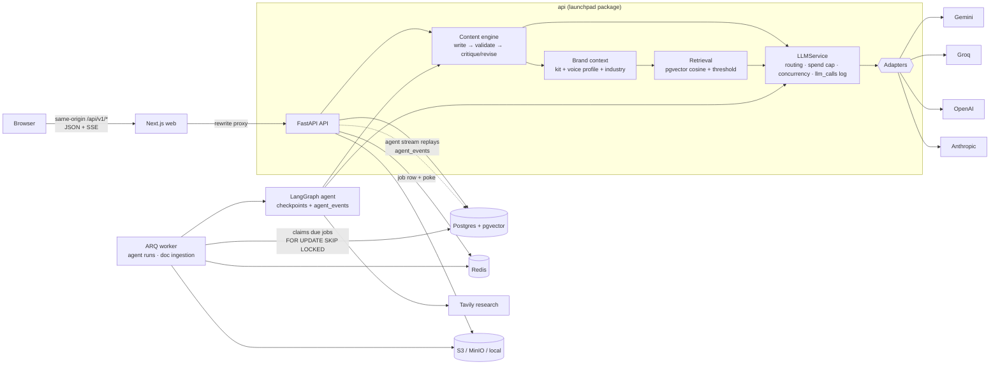
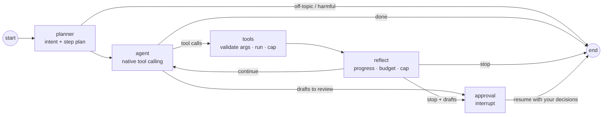

# Launchpad

An agentic AI marketing platform for small businesses. It plans campaigns, writes channel-specific content, designs posters and schedules everything. Nothing goes out without a human approving it.

> **Status:** Phase 3 of 7. On top of the Phase 1 scaffold you get:
> - a provider-neutral LLM layer (Gemini, Groq, OpenAI, Anthropic)
> - brand knowledge (RAG over documents and websites)
> - a content engine that writes, critiques and revises
> - the create-content studio
> - per-workspace AI routing, a spend cap and usage tracking
> - **a LangGraph marketing agent**: plans, researches (with sources), builds validated campaign calendars and writes drafts, then pauses for your approval. It runs in the worker, checkpoints to Postgres and streams every step to a two-pane chat UI.
> - an evaluation harness for content and agent behaviour
>
> Images and posters (Phase 4) and scheduling/publishing (Phase 5) come next. Their agent tools exist as explicit "not available yet" stubs.

## Architecture



- **web/**: Next.js 16, TypeScript, Tailwind v4, shadcn/ui. The typed API client is generated from the backend's OpenAPI spec.
- **api/**: FastAPI, Pydantic v2, SQLAlchemy 2 (async), Alembic. It also holds the shared `launchpad` domain package.
- **worker/**: an ARQ worker. `ScheduledJob` rows in Postgres are the source of truth, and Redis is only the transport. So jobs survive restarts and can't double-run.

## The agent



A run starts when you send a message (`POST /agent/runs`). The API only records the run and enqueues a durable job. The **worker** executes the graph, and LangGraph's Postgres checkpointer saves state after every node. Every step is appended to `agent_events` (for the live stream) and `agent_messages` (the trace).

| Tool | What it does |
| --- | --- |
| `get_brand_context` | Brand kit, voice and retrieved facts from the brand's own documents (with sources) |
| `research_trends` | Tavily web search (India) returning source URLs to cite, plus an Indian festival calendar for the next 12 months (dates from the DoPT 2027 holiday list and panchang sources; moon-dependent dates flagged) |
| `plan_campaign` | Goal + dates + channels → a dated calendar, validated: dates in range, allowed channels, per-day limit, spread, festival timing |
| `write_content`, `build_email` | The Phase 2 content engine (write → validate → critique/revise). Results are saved as **drafts** |
| `critique_content`, `suggest_hashtags` | Review or improve an existing draft; hashtag buckets |
| `get_analytics` | Returns "no data" until Phase 6 connects real insights. Never estimates |
| `generate_image`, `create_poster`, `schedule_content` | Stubs that say plainly they arrive in Phase 4/5 |

**Guardrails**
- At most `AGENT_MAX_TOOL_CALLS` (default 25) tool calls per run.
- Per-run token and cost budgets.
- Off-topic and harmful requests are refused by the planner before any tool runs.
- **No tool can publish, post, send or schedule.** Each tool declares `outbound`, and `assert_no_outbound()` fails at import if any tool sets it. Approval is applied only from your explicit decisions.

### Agent API

| Endpoint | |
| --- | --- |
| `POST /api/v1/workspaces/{ws}/agent/runs` | `{message, thread_id?}`: starts a run (a new conversation, or continues `thread_id`). 409 if that conversation already has a run in progress or waiting for review. |
| `GET …/agent/runs?thread_id=` | Run history |
| `GET …/agent/runs/{id}` | A run plus its full event log |
| `GET …/agent/runs/{id}/stream?after=N` | SSE: replays events after `N` (or `Last-Event-ID`), then follows live ones. Ends after `run_finished`. |
| `POST …/agent/runs/{id}/resume` | `{decisions: [{item_id, action, content?}]}`, where `action` is approve, reject or edit. Only while waiting for approval; a second submit gets 409. |
| `POST …/agent/runs/{id}/cancel` | Stops the run before its next model or tool call. Drafts already written stay drafts. |

### Idempotency keys

`POST /agent/runs` and `POST /content/generate` accept an `Idempotency-Key` header. The web app sends a fresh UUID per click.
- **Same key, same body:** the original's result. A repeated agent run returns the same run; a repeated generation waits for the original and streams its saved drafts instead of generating again.
- **Same key, different body:** 422.
- **Failed original:** the key is released, so a retry runs for real.
- **Expiry:** keys expire after 24 hours.

### Agent event stream

Every event has an SSE `id:` (its sequence number in the run), so clients resume exactly where they left off, including across an API restart.

| Event | Data |
| --- | --- |
| `run_started` | `run_id`, `thread_id`, `message` |
| `plan` | `goal`, `steps[{id, title, tool, status}]`, re-sent as steps complete; or `{refused, intent, reply}` |
| `step_started` | `key`, `label` (e.g. "Thinking", "Researching trends…", "Resuming after an interruption") |
| `tool_call` | `id`, `tool`, `input` |
| `tool_result` | `id`, `tool`, `ok`, `duration_ms`, `output` (truncated for display) |
| `token` | `text`, `final`: model text for this turn |
| `research` | `query`, `sources[{title, url}]` |
| `item_created` | `item_id`, `label`, `channel`, `angle`, `preview`, `avg_score`, `blocked_by_platform_rules` |
| `approval_required` | `items[{item_id, channel, label, angle, preview, blocked}]`, `final`. The run pauses here. |
| `approvals_applied` | `approved`, `rejected`, `edited`, `skipped` |
| `error` | `code`, `message`, `hint`, `provider?`, `model?` |
| `run_finished` | `status` (`finished`, `refused`, `tool_cap`, `budget_exceeded`, `cancelled`, `failed`), `final?`, `item_ids?`, `tokens`, `cost_usd`, `cost_complete` (false when a model's price is unknown; the UI then says so instead of showing $0) |

## Quick start (Docker)

```bash
cp .env.example .env
make keys                  # or: py scripts\tasks.py keys — paste the output into .env
docker compose up --build  # postgres, redis, minio, migrate, api, worker, web
```

Then open http://localhost:3000 for the web app, or http://localhost:8000/docs for the API docs.

## Local development (no Docker)

You need Python 3.11+, Node 22+, Redis, and Postgres 16+ with the `vector` extension. Every task works two ways:

- **With `make`** (Linux, macOS, CI): `make <task>`
- **Without `make`** (e.g. Windows, no extra installs): `py scripts\tasks.py <task>`, or `python3 scripts/tasks.py <task>` on macOS/Linux

The Makefile is a thin wrapper around `scripts/tasks.py`, so both always do the same thing. Run either with no task to list them all.

| Task | What it does |
| --- | --- |
| `setup` | Creates `api/.venv`, installs API + worker + web deps, installs the git hooks |
| `keys` | Prints fresh `JWT_SECRET` / `TOKEN_ENCRYPTION_KEYS` for `.env` |
| `doctor` | Checks toolchain, services and required env vars (see below) |
| `db-init` / `db-start` / `db-stop` | A project-local Postgres + pgvector cluster in `.devdb/` on port 5434. Needs no Docker and no admin password. |
| `migrate` / `migration "msg"` | Apply / autogenerate Alembic migrations |
| `dev` | API (:8000) + worker + web (:3000) together. Ctrl+C stops all three. |
| `dev-api` / `dev-worker` / `dev-web` | Run one service |
| `check` | Everything CI runs: `lint`, `typecheck`, `test` |
| `gen-api` | Regenerate `web/openapi.json` and the typed TS client |
| `up` / `down` / `logs` | Docker Compose stack |

First run on Windows:

```powershell
py -3.11 scripts\tasks.py setup
copy .env.example .env            # then paste your API keys into .env
py scripts\tasks.py keys          # paste the two lines into .env
py scripts\tasks.py db-init       # prints the DATABASE_URL to put in .env
py scripts\tasks.py migrate
py scripts\tasks.py doctor
py scripts\tasks.py dev
```

Tests never touch your dev data. They use `TEST_DATABASE_URL`, or if that's unset, the `*_test` database next to `DATABASE_URL`, which `db-init` creates for you.

### Doctor

`make doctor` (or `py scripts\tasks.py doctor`) checks your machine before you debug anything else. It verifies:

- Python ≥ 3.11 and Node ≥ 22
- Postgres is reachable and has the `pgvector` extension
- Redis is reachable
- storage (local dir or S3 bucket) is writable
- every env var required by your chosen providers is set

Missing variables are listed **by name only**: values are never printed. It exits non-zero if anything fails.

```text
  ✓ Python    3.11.0 (need >= 3.11)
  ✓ Postgres  18.3 at postgresql://launchpad@localhost:5434/launchpad
  ✓ pgvector  extension installed (v0.8.2)
  ✗ Env vars  missing or invalid: LLM_MODEL, GEMINI_API_KEY
```

### Pre-commit hooks (secret scanning)

`make setup` installs the git hooks (`pre-commit install`). Every commit then runs:

| Hook | What it does |
| --- | --- |
| **gitleaks** | Blocks API keys, tokens and private keys in staged changes. CI also scans the **full history**. |
| ruff + ruff-format | Python lint and formatting |
| mypy (strict) | Type-checks `api/` and `worker/` |
| eslint + prettier | Web lint and formatting |
| hygiene | Merge markers, large files, private keys, YAML validity |

Run everything manually with `api/.venv/bin/pre-commit run --all-files`. If gitleaks flags a real secret, **rotate it**: deleting it in a later commit doesn't remove it from history. For a genuine false positive, add an inline `gitleaks:allow` comment and explain why in the PR.

## Environment variables

See [`.env.example`](.env.example) for the full list. The important ones:

| Variable | Purpose |
| --- | --- |
| `DATABASE_URL` | Postgres (asyncpg) connection string |
| `REDIS_URL` | ARQ queue and rate limiting |
| `JWT_SECRET` | Signs session tokens (`AUTH_PROVIDER=local`) |
| `TOKEN_ENCRYPTION_KEYS` | Fernet keys that encrypt OAuth tokens at rest. Comma-separate them to rotate. |
| `LLM_PROVIDER`, `LLM_MODEL` | `groq` / `gemini` / `openai` / `anthropic`, plus a current model ID. There are **no code defaults**: `.env.example` lists IDs checked against each provider's docs (with dates). |
| `LLM_FAST_MODEL` | Cheaper model for review, hashtags and extraction (falls back to `LLM_MODEL`) |
| `GEMINI_API_KEY`, `GROQ_API_KEY`, `OPENAI_API_KEY`, `ANTHROPIC_API_KEY` | Provider keys. A workspace can only route to providers whose key is set. |
| `EMBEDDING_PROVIDER`, `EMBEDDING_MODEL`, `EMBEDDING_DIM` | Brand-doc RAG. Defaults to 768-d, which must match the `vector(768)` column. |
| `RAG_MIN_SCORE` | Retrieved passages below this cosine similarity are dropped (default 0.55) |
| `DAILY_SPEND_CAP_USD` | Per-workspace daily AI budget (overridable in Settings → AI) |
| `LLM_MAX_RETRIES` | Retries on 429/5xx/timeouts only (default 3) |
| `LLM_MAX_CONCURRENCY` | Max simultaneous calls per provider per process (default 4). Use 1 on Groq's free tier (8k tokens/min). |
| `AGENT_MAX_TOOL_CALLS` | Tool calls allowed per agent run (default 25) |
| `AGENT_RUN_TOKEN_BUDGET`, `AGENT_RUN_COST_BUDGET_USD` | Per-run budgets; the agent stops and says so when either is reached |
| `TAVILY_API_KEY` | Web research. Without it the agent still gets the festival calendar and says research isn't configured. |
| `LOG_LLM_PAYLOADS` | Store prompts and outputs on `llm_calls` rows (default `false`) |
| `CORS_ORIGINS` | Comma-separated allowed origins |

## Evaluation ("I measured my agent")

`api/evals/` runs the real pipeline against **3 fixture businesses** (a Bandra café, a B2B SaaS company, a Koramangala strength studio). Each has a brand kit and a brand document, ingested through the same RAG code. The run covers **10 briefs** across Instagram posts and carousels, LinkedIn, X and email.

```bash
make eval p=gemini                                    # or: py scripts\tasks.py eval gemini
make eval p=groq a="--model openai/gpt-oss-120b --fast-model openai/gpt-oss-20b"
make eval p=--fake                                    # offline harness check (also runs in CI)
make eval p=groq a="--smoke"                          # quick check: Kadak Tees x 3 briefs
```

If the provider's quota runs out mid-run (a 429 that survives the client's retries, like a daily token limit), the eval **stops cleanly**. The completed briefs are saved in a report marked **PARTIAL**, which lists what was skipped and what the provider said.

`make eval` also runs **5 agent scenarios** (`--suite all|content|agent`):
- a café cold-coffee campaign (Instagram + email) that must reach approval with drafts
- festival research that must name a festival from the calendar and cite a returned source
- an off-topic request and a fake-reviews request, which must be refused with zero tool calls
- an analytics question, which must not invent metrics

Every check is computed from the run's own event log. No model judges another model. Every scenario also fails if the reply claims to have published, posted, scheduled or sent anything.

Each run writes `evals/reports/<date>/<provider>-<time>.md` and `.json`:

| Metric | What it tells you |
| --- | --- |
| Schema-valid rate, JSON-repair rate | How often the model returns usable structured output first time |
| Hard/soft platform violations, draft → final | Whether review actually fixes limits (character counts, hashtags, slides) |
| Critique score before → after revision | How much the revise loop improves drafts (a self-assessment, used to compare runs) |
| Latency, cost, failed calls | Taken from the run's own `llm_calls` rows, not estimated |

Reports record the model IDs, the git SHA and each prompt's content-hashed version. Two runs are only comparable when those match.

**Latest numbers (2026-10-06).** No complete live run yet, because both providers ran out of quota before a run could finish:
- Gemini: the configured project has no quota for generating text.
- Groq: the free tier's 200,000 tokens/day on `gpt-oss-120b` ran out after 1 of 10 content briefs.

Only the offline harness has passed in full: 10/10 briefs and 5/5 agent scenarios on the scripted model. That proves the harness works, not that the models are good. This section will carry real numbers once a full run completes.

## Design decisions

- **Why human approval is a graph interrupt.** The approval node calls LangGraph's `interrupt()`. The run is checkpointed and stops spending, and nothing waits in memory. Your decisions come back as `Command(resume=…)` in a new worker job. The model never approves anything: only the approval node does, and only from your explicit choices. It refuses to approve drafts that break a platform limit.
- **Why Postgres checkpointing.** State is saved after every node in the same Postgres the app already runs. A worker crash or deploy mid-run resumes from the last completed node: the job is re-claimed, and finished steps and tool calls aren't repeated (covered by a test that kills a run mid-flight). An API restart doesn't touch runs at all, because the API never executes graphs. Clients just reconnect to the stream, which replays from `agent_events`. Redis or in-memory checkpoints would lose paused runs on restart.
- **Why tools can't publish.** The agent works on your brand's voice in public. A model mistake should cost a draft, not a post. Publishing is a Phase 5 action that a human triggers, with its own audit trail. Agent tools are capped at drafts, and that is enforced in code (`outbound` flag + import-time assertion + test).
- **Validators after generation apply to the agent too.** `plan_campaign` checks dates, channels and festival timing in code. Every variant is checked for the brief's prices and percentages; a missing one sends it back for revision.

- **Platform rules are checked after generation, not just described in the prompt.** Models are unreliable at counting characters and hashtags. The prompt states the limits; deterministic validators then enforce them. A hard violation goes back into the critique/revise loop. If it survives, the draft is flagged as blocked and can't be approved. It is never silently truncated.
- **There are no silent fallbacks, anywhere.**
  - Invalid structured output gets exactly one repair retry, with the validation error fed back, then a typed error.
  - A missing key or model fails with "check `.env`".
  - Routing never switches provider behind your back.
  - The UI shows every failure with its cause, a fix hint and a request ID.
- **Every model call is logged and costed**, with prompt payloads stored only on request. Usage, spend caps and evals all read the same `llm_calls` table. Prices carry their source and date, and unknown prices are reported as unknown rather than guessed.
- **Prompts are versioned files.** The stored version includes a hash of the prompt file and every shared partial, so any quality change can be traced to a prompt edit.
- **Retrieval only compares like with like.** Chunks store their embedding model and dimension. Search ignores vectors from a different model, and the UI asks you to re-index instead.
- **The Anthropic adapter uses the official SDK; Gemini/Groq/OpenAI use raw HTTP.** Each choice keeps that provider's surface well supported. All four share one retry, error and structured-output policy, so they behave the same.

## Security notes

- `.env` has been git-ignored since the first commit. Only `.env.example` (placeholders) is tracked.
- Passwords are hashed with argon2. Sessions use an httpOnly, SameSite=Lax cookie on the web origin.
- Third-party OAuth tokens are encrypted in the database (`EncryptedText` column type, MultiFernet).
- Request bodies have a size limit; auth, generation and retrieval endpoints are rate-limited through Redis.
- Uploads are type-sniffed from their content (never trusted from the name or header). Website import blocks private and loopback addresses on every redirect hop (SSRF) and respects robots.txt.
- Generated email HTML is autoescaped and passed through an allow-list sanitiser (`nh3`); previews render in a sandboxed iframe. Secret-looking keys and values are redacted from logs. Every response carries an `X-Request-ID`.

## Assumptions

- An agent "run" is one user message and everything the agent does about it. A conversation (`thread_id`) is a sequence of runs that share LangGraph state.
- During review, drafts you don't decide on stay drafts. An edit counts as an approval of the edited version, after it passes the platform rules again.
- Festival dates for 2027 follow the central government's gazetted holiday list (DoPT O.M., 16 Jul 2026). Regional festivals use dates where panchang sources agreed. Dates where they disagreed (e.g. Bhai Dooj 2026) are left out, not guessed.
- Web research is scoped to India and the last month by default. The agent has to cite returned URLs; it can't add sources of its own.

## Known limitations

- **Provider quotas:** on free tiers a 3-variant generation with review takes a few minutes, and a full eval doesn't fit in Groq's daily token allowance.
- **Event stream polling:** the stream polls `agent_events` every 0.5 s. That's fine at small scale; a pub/sub fan-out would replace it under load.
- **Brand documents:** PDFs without headings become one large passage, which makes retrieval coarse. Scanned PDFs need OCR, and SVG logos are rejected.
- **Onboarding:** refreshing mid-way can create a duplicate workspace.
- **Duplicate generation (root cause not proven).** On 2026-10-06 one page started two sequential generations from what was recorded as one click. A replay of the same flow, with the same proxy path and a 6-minute stream, sent exactly one request, and the logs from the original incident were gone. Two real gaps were found and fixed:
  - a same-tick double-submit race: the in-flight guard read React state, so it now uses a synchronous ref;
  - a pre-hydration click on Generate natively submitting the form.

  Every generation and agent run now carries an idempotency key, so a repeated request returns the original result.
