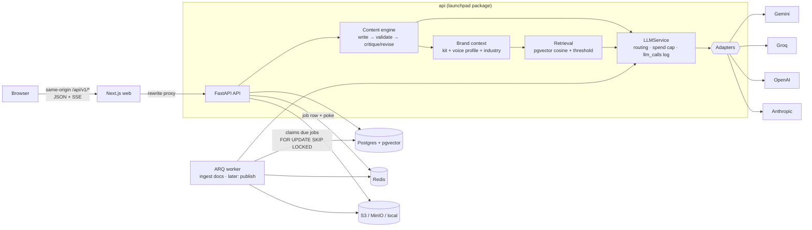

# Launchpad

An agentic AI marketing platform for small businesses. It plans campaigns, writes channel-specific content, designs posters and schedules everything. Nothing goes out without a human approving it.

> **Status:** Phase 2 of 7. On top of the Phase 1 scaffold, you now get:
> - a provider-neutral LLM layer (Gemini, Groq, OpenAI, Anthropic)
> - brand knowledge (RAG over documents and websites)
> - a content engine that writes, critiques and revises
> - the create-content studio
> - per-workspace AI routing, a spend cap and usage tracking
> - an evaluation harness
>
> The LangGraph agent, posters and publishing come in later phases.

## Architecture



- **web/**: Next.js 16, TypeScript, Tailwind v4, shadcn/ui. The typed API client is generated from the backend's OpenAPI spec.
- **api/**: FastAPI, Pydantic v2, SQLAlchemy 2 (async), Alembic. It also holds the shared `launchpad` domain package.
- **worker/**: an ARQ worker. `ScheduledJob` rows in Postgres are the source of truth, and Redis is only the transport. So jobs survive restarts and can't double-run.

## Quick start (Docker)

```bash
cp .env.example .env
make keys                  # or: py scripts\tasks.py keys — paste the output into .env
docker compose up --build  # postgres, redis, minio, migrate, api, worker, web
```

Then open http://localhost:3000 for the web app, or http://localhost:8000/docs for the API docs.

## Local development (no Docker)

You need Python 3.11+, Node 22+, Redis, and Postgres 16+ with the `vector` extension. Every task works two ways:

- **With `make`** (Linux, macOS, CI): `make <task>`
- **Without `make`** (e.g. Windows, no extra installs): `py scripts\tasks.py <task>`, or `python3 scripts/tasks.py <task>` on macOS/Linux

The Makefile is a thin wrapper around `scripts/tasks.py`, so both always do the same thing. Run either with no task to list them all.

| Task | What it does |
| --- | --- |
| `setup` | Creates `api/.venv`, installs API + worker + web deps, installs the git hooks |
| `keys` | Prints fresh `JWT_SECRET` / `TOKEN_ENCRYPTION_KEYS` for `.env` |
| `doctor` | Checks toolchain, services and required env vars (see below) |
| `db-init` / `db-start` / `db-stop` | A project-local Postgres + pgvector cluster in `.devdb/` on port 55432. Needs no Docker and no admin password. |
| `migrate` / `migration "msg"` | Apply / autogenerate Alembic migrations |
| `dev` | API (:8000) + worker + web (:3000) together. Ctrl+C stops all three. |
| `dev-api` / `dev-worker` / `dev-web` | Run one service |
| `check` | Everything CI runs: `lint`, `typecheck`, `test` |
| `gen-api` | Regenerate `web/openapi.json` and the typed TS client |
| `up` / `down` / `logs` | Docker Compose stack |

First run on Windows:

```powershell
py -3.11 scripts\tasks.py setup
copy .env.example .env            # then paste your API keys into .env
py scripts\tasks.py keys          # paste the two lines into .env
py scripts\tasks.py db-init       # prints the DATABASE_URL to put in .env
py scripts\tasks.py migrate
py scripts\tasks.py doctor
py scripts\tasks.py dev
```

Tests never touch your dev data. They use `TEST_DATABASE_URL`, or if that's unset, the `*_test` database next to `DATABASE_URL`, which `db-init` creates for you.

### Doctor

`make doctor` (or `py scripts\tasks.py doctor`) checks your machine before you debug anything else. It verifies:

- Python ≥ 3.11 and Node ≥ 22
- Postgres is reachable and has the `pgvector` extension
- Redis is reachable
- storage (local dir or S3 bucket) is writable
- every env var required by your chosen providers is set

Missing variables are listed **by name only**: values are never printed. It exits non-zero if anything fails.

```text
  ✓ Python    3.11.0 (need >= 3.11)
  ✓ Postgres  18.3 at postgresql://launchpad@localhost:55432/launchpad
  ✓ pgvector  extension installed (v0.8.2)
  ✗ Env vars  missing or invalid: LLM_MODEL, GEMINI_API_KEY
```

### Pre-commit hooks (secret scanning)

`make setup` installs the git hooks (`pre-commit install`). Every commit then runs:

| Hook | What it does |
| --- | --- |
| **gitleaks** | Blocks API keys, tokens and private keys in staged changes. CI also scans the **full history**. |
| ruff + ruff-format | Python lint and formatting |
| mypy (strict) | Type-checks `api/` and `worker/` |
| eslint + prettier | Web lint and formatting |
| hygiene | Merge markers, large files, private keys, YAML validity |

Run everything manually with `api/.venv/bin/pre-commit run --all-files`. If gitleaks flags a real secret, **rotate it**: deleting it in a later commit doesn't remove it from history. For a genuine false positive, add an inline `gitleaks:allow` comment and explain why in the PR.

## Environment variables

See [`.env.example`](.env.example) for the full list. The important ones:

| Variable | Purpose |
| --- | --- |
| `DATABASE_URL` | Postgres (asyncpg) connection string |
| `REDIS_URL` | ARQ queue and rate limiting |
| `JWT_SECRET` | Signs session tokens (`AUTH_PROVIDER=local`) |
| `TOKEN_ENCRYPTION_KEYS` | Fernet keys that encrypt OAuth tokens at rest. Comma-separate them to rotate. |
| `LLM_PROVIDER`, `LLM_MODEL` | `groq` / `gemini` / `openai` / `anthropic`, plus a current model ID. There are **no code defaults**: `.env.example` lists IDs checked against each provider's docs (with dates). |
| `LLM_FAST_MODEL` | Cheaper model for review, hashtags and extraction (falls back to `LLM_MODEL`) |
| `GEMINI_API_KEY`, `GROQ_API_KEY`, `OPENAI_API_KEY`, `ANTHROPIC_API_KEY` | Provider keys. A workspace can only route to providers whose key is set. |
| `EMBEDDING_PROVIDER`, `EMBEDDING_MODEL`, `EMBEDDING_DIM` | Brand-doc RAG. Defaults to 768-d, which must match the `vector(768)` column. |
| `RAG_MIN_SCORE` | Retrieved passages below this cosine similarity are dropped (default 0.55) |
| `DAILY_SPEND_CAP_USD` | Per-workspace daily AI budget (overridable in Settings → AI) |
| `LLM_MAX_RETRIES` | Retries on 429/5xx/timeouts only (default 3) |
| `LOG_LLM_PAYLOADS` | Store prompts and outputs on `llm_calls` rows (default `false`) |
| `CORS_ORIGINS` | Comma-separated allowed origins |

## Evaluation ("I measured my agent")

`api/evals/` runs the real pipeline against **3 fixture businesses** (a Bandra café, a B2B SaaS company, a Koramangala strength studio). Each has a brand kit and a brand document, ingested through the same RAG code. The run covers **10 briefs** across Instagram posts and carousels, LinkedIn, X and email.

```bash
make eval p=gemini                                    # or: py scripts	asks.py eval gemini
make eval p=groq a="--model openai/gpt-oss-120b --fast-model openai/gpt-oss-20b"
make eval p=--fake                                    # offline harness check (also runs in CI)
```

Each run writes `evals/reports/<date>/<provider>-<time>.md` and `.json`:

| Metric | What it tells you |
| --- | --- |
| Schema-valid rate, JSON-repair rate | How often the model returns usable structured output first time |
| Hard/soft platform violations, draft → final | Whether review actually fixes limits (character counts, hashtags, slides) |
| Critique score before → after revision | How much the revise loop improves drafts (a self-assessment, used to compare runs) |
| Latency, cost, failed calls | Taken from the run's own `llm_calls` rows, not estimated |

Reports record the model IDs, the git SHA and each prompt's content-hashed version. Two runs are only comparable when those match.

## Design decisions

- **Platform rules are checked after generation, not just described in the prompt.** Models are unreliable at counting characters and hashtags. The prompt states the limits; deterministic validators then enforce them. A hard violation goes back into the critique/revise loop. If it survives, the draft is flagged as blocked and can't be approved. It is never silently truncated.
- **There are no silent fallbacks, anywhere.**
  - Invalid structured output gets exactly one repair retry, with the validation error fed back, then a typed error.
  - A missing key or model fails with "check `.env`".
  - Routing never switches provider behind your back.
  - The UI shows every failure with its cause, a fix hint and a request ID.
- **Every model call is logged and costed**, with prompt payloads stored only on request. Usage, spend caps and evals all read the same `llm_calls` table. Prices carry their source and date, and unknown prices are reported as unknown rather than guessed.
- **Prompts are versioned files.** The stored version includes a hash of the prompt file and every shared partial, so any quality change can be traced to a prompt edit.
- **Retrieval only compares like with like.** Chunks store their embedding model and dimension. Search ignores vectors from a different model, and the UI asks you to re-index instead.
- **The Anthropic adapter uses the official SDK; Gemini/Groq/OpenAI use raw HTTP.** Each choice keeps that provider's surface well supported. All four share one retry, error and structured-output policy, so they behave the same.

## Security notes

- `.env` has been git-ignored since the first commit. Only `.env.example` (placeholders) is tracked.
- Passwords are hashed with argon2. Sessions use an httpOnly, SameSite=Lax cookie on the web origin.
- Third-party OAuth tokens are encrypted in the database (`EncryptedText` column type, MultiFernet).
- Request bodies have a size limit; auth, generation and retrieval endpoints are rate-limited through Redis.
- Uploads are type-sniffed from their content (never trusted from the name or header). Website import blocks private and loopback addresses on every redirect hop (SSRF) and respects robots.txt.
- Generated email HTML is autoescaped and passed through an allow-list sanitiser (`nh3`); previews render in a sandboxed iframe. Secret-looking keys and values are redacted from logs. Every response carries an `X-Request-ID`.
