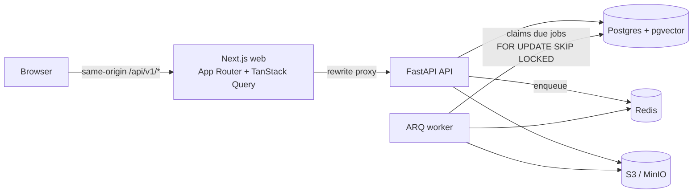

# Launchpad

An agentic AI marketing platform for small businesses. It plans campaigns, writes channel-specific content, designs posters and schedules everything. Nothing goes out without a human approving it.

> **Status:** Phase 1 of 7 (scaffold). Auth, workspaces, brand kit basics, the full data model, a durable job worker and CI are in place. The agent, content generation, posters and publishing land in later phases.

## Architecture



- **web/**: Next.js 16, TypeScript, Tailwind v4, shadcn/ui. The typed API client is generated from the backend's OpenAPI spec.
- **api/**: FastAPI, Pydantic v2, SQLAlchemy 2 (async), Alembic. It also holds the shared `launchpad` domain package.
- **worker/**: an ARQ worker. `ScheduledJob` rows in Postgres are the source of truth, and Redis is only the transport. So jobs survive restarts and can't double-run.

## Quick start (Docker)

```bash
cp .env.example .env
make keys >> .env          # appends fresh JWT_SECRET + TOKEN_ENCRYPTION_KEYS (later values win)
docker compose up --build  # postgres, redis, minio, migrate, api, worker, web
```

Then open http://localhost:3000 for the web app, or http://localhost:8000/docs for the API docs.

## Local development (no Docker)

You need Python 3.11, Node 22, Postgres 16+ with the `vector` extension, and Redis.

```bash
make setup                 # venv + pip install -e api[dev] worker, npm ci
make migrate
make dev-api   # :8000
make dev-worker
make dev-web   # :3000
```

Run `make check` to lint, type-check and test. Tests need `TEST_DATABASE_URL`, pointing at a disposable database.

## Environment variables

See [`.env.example`](.env.example) for the full list. The important ones:

| Variable | Purpose |
| --- | --- |
| `DATABASE_URL` | Postgres (asyncpg) connection string |
| `REDIS_URL` | ARQ queue and rate limiting |
| `JWT_SECRET` | Signs session tokens (`AUTH_PROVIDER=local`) |
| `TOKEN_ENCRYPTION_KEYS` | Fernet keys that encrypt OAuth tokens at rest. Comma-separate them to rotate. |
| `LLM_PROVIDER`, `LLM_MODEL` | `groq` / `gemini` / `openai` / `anthropic`, plus a current model ID. There are **no defaults**: copy the ID from the provider's docs. |
| `CORS_ORIGINS` | Comma-separated allowed origins |

## Security notes

- `.env` has been git-ignored since the first commit. Only `.env.example` (placeholders) is tracked.
- Passwords are hashed with argon2. Sessions use an httpOnly, SameSite=Lax cookie on the web origin.
- Third-party OAuth tokens are encrypted in the database (`EncryptedText` column type, MultiFernet).
- Request bodies have a size limit, and auth endpoints are rate-limited through Redis. Secret-looking keys and values are redacted from logs. Every response carries an `X-Request-ID`.
